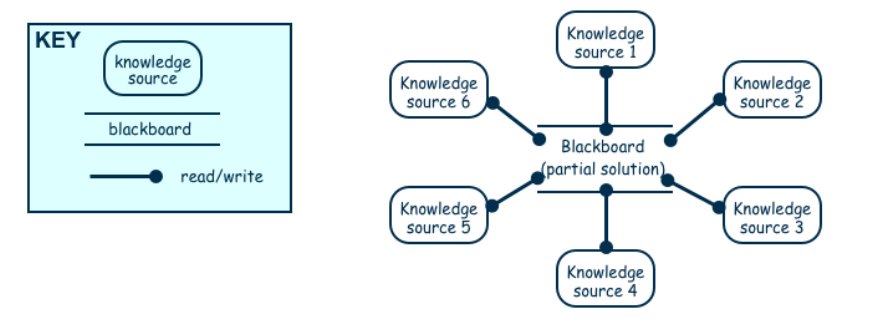

# Repository Diagram

# What this all means
> # Blackboard
> For us, the repository that we are sourcing most of our files from is Minecraft itself. From there, we get a lot of the properties for our blocks, and a platform on which to test on. 
> This is just a diagram, meaning that we are not actually using 6 knowledge sources, we are only using 3.

> # Knowledge source 1:
> Knowledge source 1 is the properties of the blocks that are already within Minecraft. Our Arcade Machine blocks have the same strength as the "Stone" block, and can be punched in order to break them.

> # Knowledge source 2:
> Knowledge source 2 is the overworld and being able to walk around in it. The fact that the game allows us to place our block and interact with it is enough for us to be able to test most of our code.

> # Knowledge source 3:
> Knowledge source 3 is our github repository, which is where we store and get all of our new textures and icons for any of the items that we add. Right now, we are using other programs such as BlockBench in order to create the blocks, and that only serves to put more blocks in the game.  
