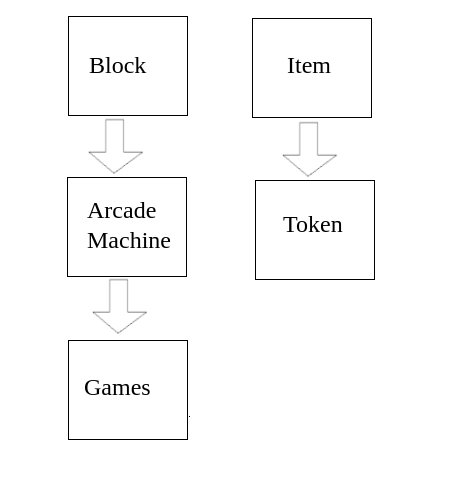
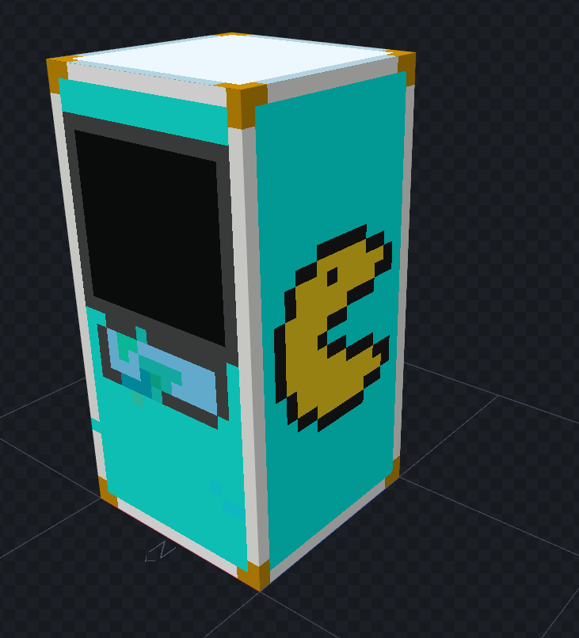

# 1.1 Purpose of Product
> After much innovation in technology, the possibilities of what can be done with computers are endless, and it would be a waste to have such computational power and not use it to have some fun. Although we are not setting the world on fire with our project, we want to provide an enjoyable and accessible experience for the user that enhances a preexisting game. Anyone with the copy of the game should be able to experience our project.

# 1.2 Scope of Product
> The first, and most important limitation for this project is that it is built on the existing Minecraft engine, and thus, we are at the whims of any bugs or errors that we have no control over, but we will try to work around these as best we can. Although Minecraft does have support for multi-player, we will focus on single-player elements and look into the possibility of multi-player in the future. When we say single-player support, we mean that people can view our mod in-game at the same time, but not interact with it at the same time.

# 1.3 Acronyms, Abbreviations, Definitions

> • Minecraft – A game where one can walk around and build and interact with the blocks around the player. Can be played single-player and multi-player.  

> • Engine – The code that a piece of software is built on.

> • Mod – A modification to a game that was not originally available, but added later by the user. Usually, this would be changing the player model, adding new enemies, adding new levels, etc.

> • Forge – A mod for Minecraft facilitates the installation of other mods for Minecraft.

> • Client – A local installation of a program that accesses servers somewhere else.

> • Single-player – When a game is played with only one player.

> • Multi-player – When a game is played with two or more players.

> • Block – A literal cube that the player sees in the game. A person can modify a cube and share their modification as a mod.

# 2.1 Context of Product

> As previously stated, our project is a Minecraft mod. Mods have existed for this game for almost as long as the game has been available, and we would be far from the first to create such a mod. However, this means that there is a substantial community for creating and sharing such mods, and it also means that there is a great deal of resources available on this game. We plan on sharing this mod once it is completed (this is subject to change) and sharing our progress in class.

# 2.2 Domain Model with Description
> The machines themselves will be blocks within 
the game, and they will be activated using tokens,
which are just items.

> In the future, this diagram will include the games that we have added and games that we designed.

# 2.3 Product Functions

> Our project is a Minecraft mod that would add arcade machines to the base game and would allow the user to walk up to one of the machines, insert a token, and play a game. The arcade machines themselves would be custom blocks made to resemble a real machine, and the tokens would be a custom item that we would make to look like a quarter. At first, we would try to create some real-life games, such as Pac-Man, then move on to creating and designing our games.

